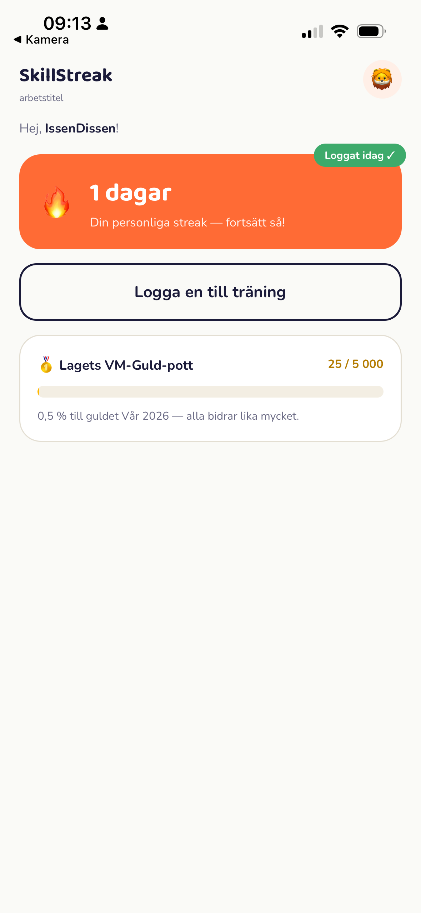
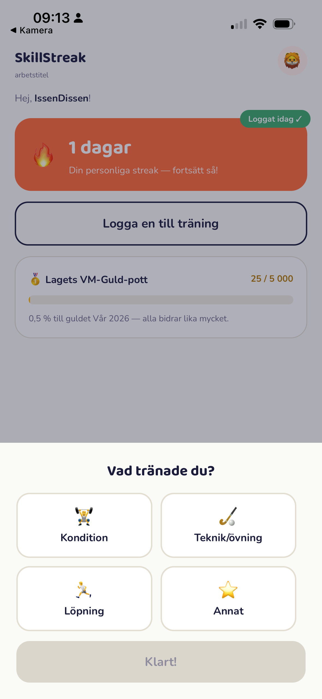
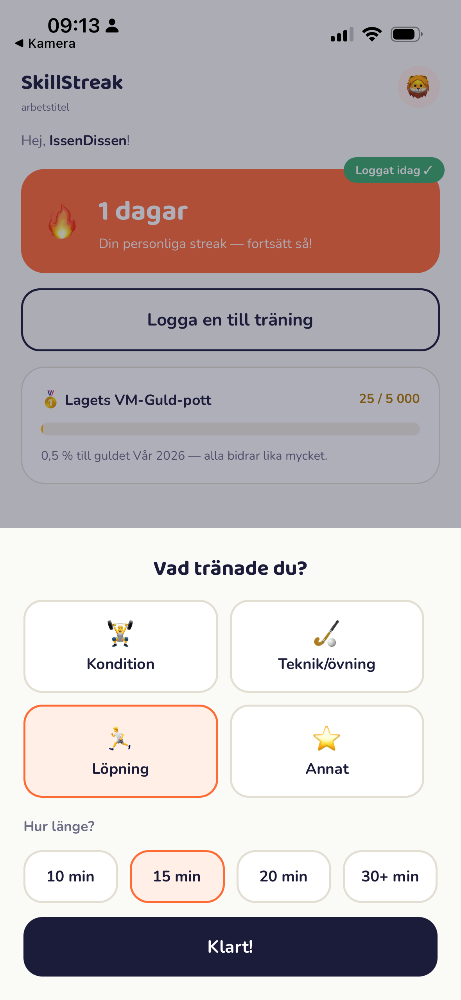

# 🔥 SkillStreak (arbetstitel)

Rörelseglädje genom gamification för ungdomslag i innebandy — se
[docs/PROJECT.md](docs/PROJECT.md) för hela visionen bakom projektet.

> ## ⚠️ Early Alpha
> Det här är en tidig betaversion under aktiv utveckling. **All data — konton,
> streaks, lagpoäng — kan raderas när som helst utan förvarning.** Använd inte
> appen för något du inte har råd att förlora. Inget här är produktionsklart
> eller granskat för en riktig lansering än.

## Skärmdumpar

<p>
  
  
  
</p>

*Riktiga skärmdumpar från en fysisk telefon, inte mockups.*

---

## Kom igång

Du behöver:

- **Docker** och **Docker Compose** (kör backend + Postgres + Redis).
- **Node.js 22+** och **[pnpm](https://pnpm.io)** (kör mobilappen).
- **[Expo Go](https://expo.dev/go)** installerad på din telefon (App Store /
  Google Play) — telefonen måste vara på **samma Wi-Fi** som datorn du kör
  backend/Expo på.

### 1. Starta backend

```bash
git clone <repo-url>
cd SkillStreak
cp .env.example .env
cp backend/.env.example backend/.env
docker compose up -d --build
```

Detta startar API:et (NestJS), Postgres och Redis, och kör databasmigrationerna
automatiskt. Kontrollera att allt svarar:

```bash
curl http://localhost:3000/health
# {"status":"ok"}
```

Lägg sedan in testdata (ett lag med en inbjudningskod) — entrypointen kör
bara migrationer, inte seed-data, så detta är ett separat steg:

```bash
docker compose exec api node dist/scripts/seed.js
```

Det skapar laget **"IBK Falken P13"** med inbjudningskoden **`FALKEN13`**.

#### E-post för föräldragodkännande (valfritt)

Utan SMTP-inställningar fungerar allt utom det riktiga e-postutskicket —
appen skapar kontot men skickar ingen fråga till en förälder. För att testa
hela flödet, inklusive en riktig länk i ett riktigt mejl, fyll i SMTP-fälten
i `.env` (Google Workspace-relä som exempel, se kommentarerna i
`.env.example`) innan `docker compose up`.

Utan riktig e-post kan du fortfarande testa flödet genom att godkänna manuellt
i databasen:

```bash
docker compose exec postgres psql -U app -d app_dev -c \
  "UPDATE player SET parental_consent_status = 'approved' WHERE screen_name = '<ditt-spelarnamn>';"
```

### 2. Starta mobilappen

Ta reda på datorns lokala IP-adress (samma nätverk som telefonen):

```bash
# Linux/macOS
ip addr show | grep "inet " | grep -v 127.0.0.1   # eller: ifconfig
```

Starta sedan Expo-servern med den adressen:

```bash
cd mobile
pnpm install
EXPO_PUBLIC_API_URL="http://<DIN-IP>:3000" npx expo start --lan
```

### 3. Anslut din telefon

Öppna **Expo Go** och skanna QR-koden som Expo-servern skriver ut i
terminalen — eller, om din version av Expo Go saknar skanningsläge direkt,
välj **"Enter URL manually"** och skriv in `exp://<DIN-IP>:8081`.

Exempel på hur QR-koden ser ut (denna pekar mot projektägarens lokala nätverk
just nu — **den fungerar bara för någon på samma Wi-Fi**; du genererar din
egen enligt ovan):


> **Obs — Expo Go-version:** Expo Go stödjer bara *en* SDK-version åt gången
> (för närvarande SDK 54 i det här projektet). Om du får ett
> "incompatible"-fel, uppdatera Expo Go till senaste versionen från App
> Store/Google Play — det löser i regel problemet.

### 4. Testa flödet

1. Ange inbjudningskoden **`FALKEN13`** (eller din egen, om du körde ett eget
   seed).
2. Välj spelarnamn, avatar, födelseår, och en förälders e-post/telefon.
3. Du hamnar på en väntskärm — kontot är skapat men låst tills en förälder
   godkänner (via mejl-länken, eller manuellt enligt ovan).
4. Efter godkännande: tryck **"Jag har tränat"**, välj aktivitet och
   längd — se din streak och lagets VM-Guld-pott uppdateras direkt.

> 🚀 **Går du live utanför ditt lokala nätverk?** Byt då `APP_PUBLIC_URL` i
> `.env` (används i godkännande-länken i mejlet) till din riktiga domän, och
> regenerera `docs/images/expo-qr.png` mot din publicerade Expo-länk istället
> för en lokal IP — se `k8s/README.md` för Kubernetes-distribution.

---

## Mer dokumentation

- [docs/PROJECT.md](docs/PROJECT.md) — ursprunglig vision, namnförslag,
  GDPR/Privacy by Design, roadmap.
- [docs/ACTION_PLAN.md](docs/ACTION_PLAN.md) — levande, detaljerad
  statuslista per fas.
- [docs/adr/](docs/adr/) — arkitekturbeslut (backend-val, datamodell,
  pakethanterare).
- [docs/api/phase1-contract.md](docs/api/phase1-contract.md) — API-kontraktet
  mellan app och backend.
- [docs/design/](docs/design/) — style guide och skärmflöden.
- [k8s/](k8s/) — Kubernetes-manifest för distribution (förberedelse inför
  extern beta).

## Bidra

Se avsnittet "Vill du vara med på resan?" i
[docs/PROJECT.md](docs/PROJECT.md) för hur du kan hjälpa till — som tränare,
utvecklare, designer, eller med idéer.

---
*Skapat med 🧡 för innebandyn och en mer aktiv vardag för våra ungdomar.*
