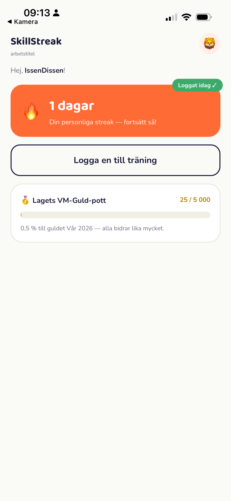
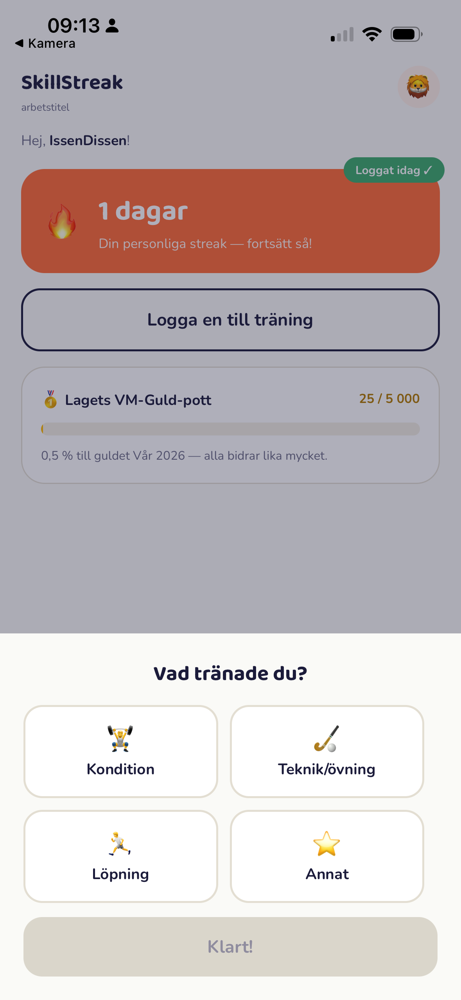
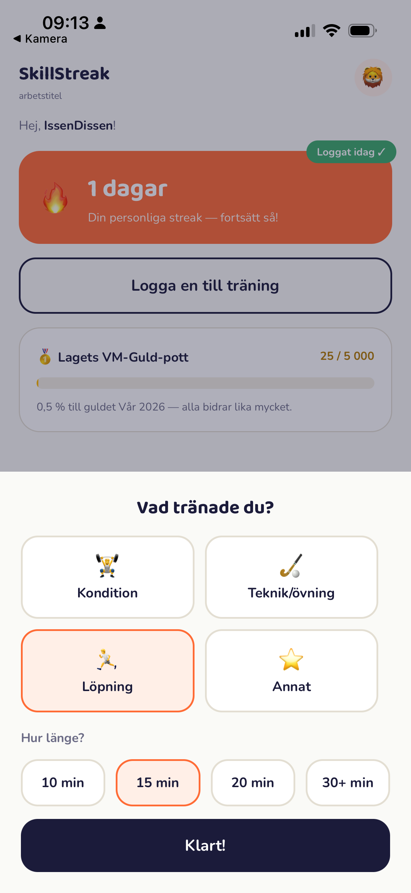

# 🔥 SkillStreak

**A training app for youth floorball teams, built by a coach who got tired
of competing with TikTok.**

Kids aged 9–13 log 15 minutes of training a day. Each of them builds a
personal streak — and every session also feeds one shared team pot, so the
whole squad chases a virtual World Championship gold together.

🇸🇪 *Sidan finns på svenska:* **[skillstreak.xyz](https://skillstreak.xyz)**

> ## ⚠️ Beta, with a store release in preparation
> Actively developed and running with a real team. **Any data — accounts,
> streaks, team points — may be reset while the beta lasts.** A first
> App Store and Google Play release is being prepared; what still has to
> be true before it happens is tracked in
> [docs/LAUNCH-CHECKLIST.md](docs/LAUNCH-CHECKLIST.md).

---

## Try it

You do not need to install anything.

| | |
|---|---|
| **See what it is** | **[skillstreak.xyz](https://skillstreak.xyz)** — Swedish and English |
| **Use the app in your browser** | **[try.skillstreak.xyz](https://try.skillstreak.xyz)** — no account, no install |
| **Come to a live demo** | **[Sign up here](https://skillstreak.xyz/?campaign=github#visning)** — early September 2026, over Google Meet |
| **Are you a coach?** | **[docs/TRAINERS.md](docs/TRAINERS.md)** — what the trainer role does, and what it deliberately cannot see |

- Want to run it yourself? → **[docs/DEVELOPMENT.md](docs/DEVELOPMENT.md)**
- Want to work on it? → **[docs/DEVELOPER.md](docs/DEVELOPER.md)**

---

## The problem it exists for

Children in youth sport train once or twice a week with the team, and then
nothing happens for five days. It is not laziness. It is that training
alone at home is invisible — nobody sees it, it does not count anywhere,
so in a real sense it did not happen.

Meanwhile the apps competing for those same five days are built by people
whose entire job is winning that competition.

SkillStreak borrows their mechanics and points them somewhere better.

## How it works

**Two game modes running at once.**

**The personal streak** is the Duolingo part: log 10–15 minutes and keep
the run alive. It belongs to one child and nobody else.

**The team pot** is the part that actually makes them log it. Every
session, from every player, adds to one shared total the team pushes
toward its VM-Guld. The least skilled kid on the roster contributes
exactly as much as the best one, because **it counts minutes, not talent**.
That was the whole design goal: the children who most need to feel
important to their team are rarely the ones scoring goals.

**Points scale with evidence, not effort.** How much a session is worth
depends on how well you show it happened:

| What you did | Multiplier |
|---|---|
| Tapped a button | ×0.1 |
| Added a photo | ×1 |
| Added a video | ×1.2 |
| Shared the video with your team | ×1.4 |

Twenty minutes is 2 points on your word alone, and 28 if the team can see
it. Honesty is not policed; it is simply worth less.

**Around that:** weekly goals a coach sets, a clip feed only the team can
see, team chat, auto-awarded badges for effort and creativity rather than
performance alone, a leaderboard showing the ten teams above and below
you, and a season that resets every 1 January.

## The rules that shaped it

Every one of these made the app harder to build. They are the reason a
parent says yes at all, so they are constraints, not features:

- **No location data. Ever.** The app records *that* a child trained,
  never where. There is no "teams near you", and there never will be.
- **Closed team bubbles.** A player only ever sees their own verified
  team. Nothing is public by default.
- **Screen names, not real names.** "FloorballStar15" is who you are here.
- **A parent approves before any media can be uploaded**, per child.
- **No analytics SDK and no third-party trackers** anywhere in a child's
  path. Product metrics are our own, aggregate-only, with a floor so no
  number can resolve to a single child.

The trainer role shows what this costs in practice. A coach is invited
*by* a team — they cannot search for one, so an adult can never go looking
through the app for children. An active team link on its own shows almost
nothing. Each child's training requires that family's separate yes, and
the player, the parent or the captain can each revoke it instantly,
without explaining.

## Screenshots

  
  
  

*Real screenshots from a physical phone, not mockups.*

## Under the hood

TypeScript throughout: **NestJS** with Postgres and Redis on the backend,
**Expo / React Native** for iOS and Android, a static marketing site, and
an admin/trainer console the API serves itself. It runs on **Kubernetes**
with CI/CD and automated releases, in nine languages.

The interesting engineering problem is not the stack — it is that the
users are children, which makes a surprising number of ordinary choices
unavailable. Most of that reasoning lives in **[docs/adr/](docs/adr/)**,
one architecture decision record per question, including the ones where
the answer was "no".

## Documentation

| | |
|---|---|
| [docs/adr/](docs/adr/) | Architecture decisions, and why — the best place to start reading |
| [docs/PROJECT.md](docs/PROJECT.md) | The roadmap (Swedish) |
| [docs/TRAINERS.md](docs/TRAINERS.md) | For coaches: what the trainer role can and cannot do |
| [docs/DEVELOPER.md](docs/DEVELOPER.md) | The codebase, explained — start here if you are going to work in it |
| [docs/DEVELOPMENT.md](docs/DEVELOPMENT.md) | Running it locally |
| [docs/RELEASING.md](docs/RELEASING.md) | Releases, app store submission, costs |
| [docs/api/phase1-contract.md](docs/api/phase1-contract.md) | The API contract between app and backend |
| [docs/design/](docs/design/) | Style guide and screen flows |
| [k8s/](k8s/) | Kubernetes manifests |

## Contributing

Questions, bugs, or want to help as a developer, designer or coach? Open
an issue. The most interesting unsolved problems right now are animated
team avatars that race each other, AI-generated training sessions, and a
marketplace for coaches — where the hard part is not the code but how you
build reputation for adults who work with children without making a good
rating the thing a bad actor farms.

---
*Built with 🧡 for floorball, and for a more active week for our kids.*
